# Distributeur Rotatif Intelligent de Médicaments pour Patients Alzheimer

| | |
|-|-|
|`Author` | Alexei Niculae |

## Description

Ce projet consiste en la réalisation d’un **distributeur intelligent de médicaments** destiné aux patients atteints de la maladie d’Alzheimer.

Le système utilise un **plateau circulaire rotatif** contenant plusieurs compartiments (jusqu’à 30), chacun stockant une dose de médicament. À une heure programmée (gérée par un module RTC), le dispositif effectue automatiquement les actions suivantes :

- rotation du plateau jusqu’au compartiment correct ;
- activation d’un signal sonore (buzzer) et visuel (LED) ;
- déverrouillage de l’accès via un servo-moteur.

Le patient ne peut accéder qu’à un seul compartiment à la fois, ce qui empêche toute erreur de dosage.

Le système inclut également une **confirmation de prise du médicament** grâce à :
- un **capteur de poids (load cell)** qui détecte une variation de masse (prise probable du médicament) ;
- un **micro-interrupteur** qui détecte l’ouverture de la trappe.
Le système est également capable de communiquer via Wi-Fi avec un aidant ou un membre de la famille.

Lorsqu’une dose est administrée, le dispositif envoie automatiquement une notification contenant l’état de la prise du médicament :
- « médicament pris » (si une variation de poids est détectée),
- « médicament non confirmé » (si aucune variation significative n’est détectée),
- « dose manquée » (si le compartiment n’a pas été ouvert dans un intervalle de temps défini).

En complément, le système intègre une caméra embarquée qui capture une image ou une courte séquence au moment de l’ouverture du compartiment. Cette capture est transmise via Wi-Fi avec la notification afin de fournir une confirmation visuelle de l’action du patient.

Cette approche permet de combiner une validation par capteur (poids) avec une preuve visuelle, améliorant ainsi la fiabilité globale du système. Cette fonctionnalité transforme le dispositif en un système de supervision à distance, permettant à un aidant de vérifier en temps réel le respect du traitement.

Le système est contrôlé par un **ESP32**, et un module **RTC DS3231** assure une gestion précise du temps même lorsque le dispositif est éteint.

---

## Motivation

Les patients atteints d’Alzheimer oublient souvent de prendre leurs médicaments ou peuvent en prendre plusieurs fois par erreur.

Ce projet vise à :
- sécuriser la prise des médicaments ;
- guider le patient avec des signaux simples (son + lumière) ;
- empêcher l’accès à des doses incorrectes ;
- détecter automatiquement si le médicament a été pris.

Il s’agit d’une application concrète combinant **systèmes embarqués, capteurs, électronique et mécanique**, avec un impact réel dans le domaine médical.

---

## Architecture

Le système est composé de plusieurs modules :

- **Module de contrôle** : ESP32
- **Module temps** : RTC DS3231
- **Module rotation** : moteur pas à pas + driver
- **Module accès** : servo-moteur + capteur d’ouverture
- **Module détection** : load cell + HX711
- **Module alerte** : buzzer + LED
- **Module alimentation** : 12V + conversion vers 5V
Le système inclut un module de communication sans fil basé sur l’ESP32, permettant l’envoi de données vers un dispositif externe (smartphone ou serveur).

Le processus de communication est le suivant :

1. Détection de l’événement (ouverture du compartiment).
2. Mesure du poids avant et après l’accès.
3. Détermination de l’état :
   - médicament pris (variation détectée),
   - médicament non pris ou incertain.
4. Capture d’une image ou d’une courte séquence via la caméra.
5. Envoi d’une notification via Wi-Fi contenant :
   - le statut de la prise,
   - l’heure de l’événement,
   - une image ou une courte séquence vidéo associée.

La communication peut être réalisée via différents protocoles :
- HTTP (requête vers un serveur web),
- MQTT (IoT),
- ou API de messagerie (ex. Telegram Bot).

Dans le cadre de ce projet, la caméra est utilisée uniquement pour fournir une confirmation visuelle de l’action, sans traitement complexe d’image.
---

### Block diagram

---

### Schematic

---

### Components

| Device | Usage | Price |
|--------|--------|-------|
| ESP32 DevKit V1 | Microcontrôleur principal avec Wi-Fi | ~35 RON |
| DS3231 RTC Module | Gestion précise du temps | ~15 RON |
| Batterie CR2032 | Sauvegarde du temps RTC | ~5 RON |
| NEMA 17 Stepper Motor | Rotation du plateau de médicaments | ~70 RON |
| DRV8825 Driver | Contrôle du moteur pas à pas | ~15 RON |
| Condensateur 100–470 µF / 25V | Stabilisation alimentation moteur | ~2 RON |
| Capteur Hall A3144 | Détection position initiale | ~5 RON |
| Aimant néodyme | Référence pour capteur Hall | ~2 RON |
| Servo MG90S | Ouverture/fermeture trappe | ~25 RON |
| Micro-interrupteur | Détection ouverture trappe | ~3 RON |
| Load Cell TAL221 100g | Détection retrait du médicament | ~25 RON |
| HX711 Module | Amplification du signal load cell | ~10 RON |
| Buzzer actif 5V | Signal sonore | ~4 RON |
| LED 5mm | Signal visuel | ~1 RON |
| Résistances 220Ω | Protection LED | ~1 RON |
| Résistances 10kΩ | Pull-up/pull-down | ~1 RON |
| LM2596 Buck Converter | Conversion 12V → 5V | ~12 RON |
| Alimentation 12V 2–3A | Source principale | ~35 RON |
| Breadboard | Prototypage | ~10 RON |
| Fils jumper | Connexions | ~10 RON |
| Boutons (x2–3) | Interface utilisateur | ~3 RON |
| Plateau rotatif | Compartiments médicaments | 3D print |
| Boîtier avec ouverture | Structure mécanique | 3D print |
| Axe central | Support rotation | ~10 RON |
| Vis + entretoises | Assemblage | ~15 RON |

---

### Libraries

| Library | Description | Usage |
|---------|-------------|-------|
| [Wire](https://www.arduino.cc/reference/en/language/functions/communication/wire/) | Communication I2C | RTC |
| [RTClib](https://github.com/adafruit/RTClib) | Gestion du module RTC | Lecture du temps |
| [HX711](https://github.com/bogde/HX711) | Lecture capteur de poids | Détection médicament |
| [AccelStepper](https://www.airspayce.com/mikem/arduino/AccelStepper/) | Contrôle moteur pas à pas | Rotation plateau |
| [ESP32Servo](https://github.com/madhephaestus/ESP32Servo) | Contrôle servo | Trappe |

---

## Log

### Week 6 - 12 May

### Week 7 - 19 May

### Week 20 - 26 May

---

## Reference links
